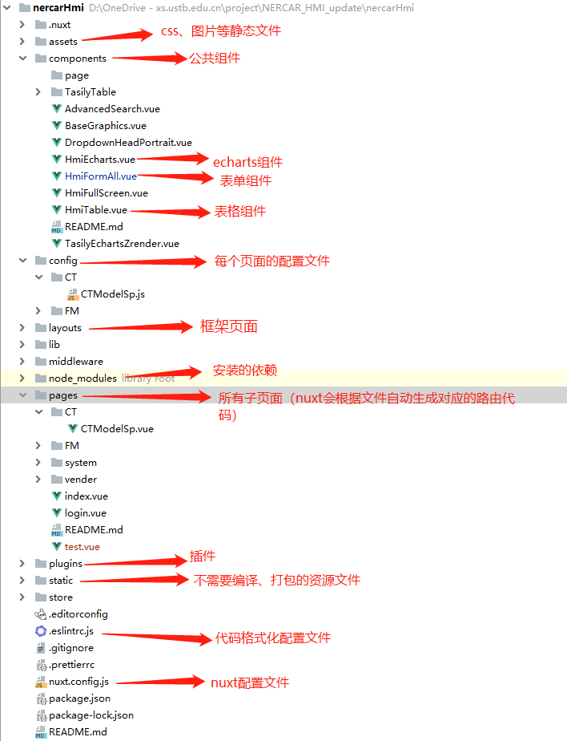
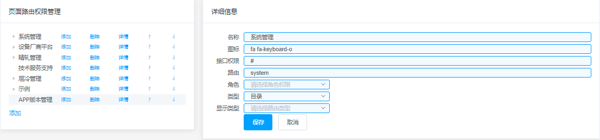

#### 常用编辑器：webstorm、Visual Studio Code

#### vscode编辑器
下载地址[https://code.visualstudio.com/]

#### git可视化工具下载
安装博客[https://www.cnblogs.com/xiuxingzhe/p/9312929.html]    
下载地址[https://download.tortoisegit.org/tgit/]


#### 安装介绍

##### 1、 安装node.js——官网下载安装即可
下载地址[https://nodejs.org/en/],一路next安装即可，可以安装在任意盘。


##### 2、常用命令行

```
克隆项目 git clone http://nercar.tpddns.cn:6001/lcx/hmi

npm run install //安装所有的依赖

//服务在热重载状态下运行在localhost:3000 （端口号具体见nuxt配置文件中server.port）
(开发状态下)npm run dev

//自动化构建/持久化运行(全局安装pm2)
(生产环境下)npm run pm2
```

#### 项目目录结构



#### 创建页面并启动项目

​	在根目录pages文件夹中找到对应的文件夹创建***.vue文件，结构如下

```
<template>
  <div>
    <h1>hello nuxt.js</h1>
    //输入框绑定变量
    <el-input
      v-model="value1"
      type="input"
      placeholder="请输入内容"/>
    //普通绑定变量
    <div>{{ value1 }}</div>
  </div>
</template>

<script>
import { get, post } from '@/lib/Util' //根据需要选择引入公共函数
import { getHmiData, sendMsg, setTags } from '@/lib/GetData' // 请求中间件函数

export default {
  name: 'Test', //页面名
  // data存放页面全局变量
  data() {
    return {
    	value1: ''， //创建变量
    	mapData: {
    	  a: ''
    	  b: [],
    	  c: {}
    	}, //json变量
    	arryData: [] //数组变量
    }
  },
  watch: {
 	//根据需要选择监听变量 
 	//例如监听： value1变量
    'value1': function(newVal, oldVal) {
        //监听处理
    },
    //监听 mapData变量中的a变量
    'mapDta.a': function(newVal, oldVal){
    	//监听处理
    }
  },
  // 画面初始化操作
  created() {
    //this.testFunction() //调用methods中的函数
  },
  // 画面挂载操作
  mounted() {
    //this.testFunction() //调用methods的函数
  },
  // 画面销毁时操作
  destroyed() {
    //离开页面时（一般使用：销毁定时器或组件）
  },
  // 函数方法写在methods中
  methods: {
  	testFunction() {
  		//自定义函数
  		// data中变量调用方法：  this.value1
  	}
  }
}
</script>
<style scoped lang="scss">
   //样式
</style>
```
​	在系统中[系统管理/URL权限管理]根据文件夹路径配置url页面信息，如图：    
 
​	启动项目（启动成功后再修改页面文件不需要再次启动，修改后会自动刷新）

```
npm run dev
```


#### 中间件交互用法

##### 1、 获取变量数据

###### （1）   页面中绑定变量

```
<div
    v-tag:tag="中间件变量名1"
    v-tag:msg=""
    data-page="路由" />
```

###### （2）   引入接口函数

```
import { getHmiData, stopGetData } from '@/lib/GetData'
```

###### （3）   函数中调用

```
getHmiData(路由, data => {
	//**解析并处理数据
})
```

###### （4）   离开页面根据需要判断是否需要

```
stopGetData()
```

##### 2、 修改数据

###### （1）   引入接口函数

```
import { setTags } from '@/lib/GetData'
```

###### （2）   函数调用

```
var data={对应中间件变量名: 'test'}

sendTag(data)
```

 

##### 3、 发送消息

###### （1）   引入接口函数

```
import { sendMsg } from '@/lib/GetData'
```

 

###### （2）   函数中调用

```
      let data = [
        [
          {
            a: 1,
            b: 2,
            c: 3,
            e: 4
          },
          {
            a: 1,
            b: 2,
            c: 3,
            e: 4
          }
        ],
        [
          {
            c: 1,
            d: 2
          }
        ]
      ]

      // sendMsg(data, msgId, sendTo, waitReply, timeout)
      var result = await sendMsg(data, 事件号, '进程名称')
      console.log(result)
      this.msgBody = JSON.stringify(result)
```


#### 组件用法——echarts组件为例 

在components文件夹下以hmi开头的.vue文件为全局组件，针对全局组件不需要在页面再再次引入    

$\textcolor{red}{注意：现已将echarts组件注册为全局组件，所以针对echarts组件本框架页面直接从3、4步骤即可，没有注册为全局的组件仍需要从第1步开始} $ 

###### 1、引入echarts组件

```
import hmiEcharts from '@/components/HmiEcharts'
```

###### 2、在components中注册组件

```
components: {
    hmiEcharts //组件注册
}
```

###### 3、在data中创建变量

```
data() {
  return {
	  echartsOption: {
        tooltip: {
          trigger: 'axis',
          confine: true
        },
        legend: {},
        grid: [
          {
            left: '3%',
            right: '4%',
            bottom: '3%',
            top: '12%',
            containLabel: true
          }
        ],
        yAxis: [
          {
            type: 'value',
            splitNumber: 2,
            scale: true
          }
        ],
        xAxis: [
          {
            type: 'category',
            data: []
          }
        ],
        series: [
          {
            type: 'line',
            smooth: true,
            data: []
          }
        ]
    }
  }
}
```

###### 4、绑定变量并渲染

```
<hmi-echarts
  :grid="echartsOption.grid"
  :tooltip="echartsOption.tooltip"
  :legend="echartsOption.legend"
  :x-axis="echartsOption.xAxis"
  :data-zoom="echartsOption.dataZoom"
  :y-axis="echartsOption.yAxis"
  :series="echartsOption.series"
  :_height="'460px'"/>
```

echarts参数配置详见其官方网站：https://echarts.apache.org/examples/zh/index.html#chart-type-line


#### 表格组件用法-HmiTable

```
<!--
:table-head="是否显示TableHead-查询之类的信息" 
:table-header="表头参数" 
:table-data="表格数据"  
:table-height="'表格高度'" 
:index-type="'index'" //是否显示序号，当为index时显示，否则不显示
-->
<hmi-table
  ref="leftTable"
  :table-head="false" 
  :table-foot="false"
  :is-pagination-show="false"
  :table-data="tableData[index]"
  :index-type="'index'">
     <template slot="TableHead">
         <!--表格查询输入框之类的一些信息-->
     </template>
</HmiTable>
```

根据配置文件具体使用方式

```
<!--
  tableHeadInfo：变量名
-->
<el-row :gutter="20">
  <el-col v-for="(item, index) in tableHeadInfo" :key="'th'+index" :span="24" class="xw_marginTB">
    <div style="font-weight: bold;">{{item.name}}</div>
    <HmiTable
      ref="leftTable"
      :table-data="tableData[index]"
      :table-header="item.data"
      :table-height="'calc(100vh - 210px)'"
      :index-type="'index'">
      <template slot="TableHead">
        <el-form
          :inline="true"
          @submit.native.prevent>
          <el-form-item label="数据来源">
            <el-checkbox-group v-model="queryConditions.dataSource">
              <el-checkbox label="轧制计划"/>
              <el-checkbox label="模轧计划"/>
            </el-checkbox-group>
          </el-form-item>
          <el-form-item label="钢卷号">
            <el-input v-model="queryConditions.coilId"/>
          </el-form-item>
          <el-form-item>
            <el-button size="mini">查询</el-button>
            <el-button size="mini">精轧预设定查看</el-button>
          </el-form-item>
        </el-form>
      </template>
    </HmiTable>
  </el-col>
</el-row>
```

#### 其他常用组件用法

详见element官方网站： https://element.eleme.cn/#/zh-CN/component/quickstart 

#### 示例

1、在pages目录下添加test.vue页面


#### 常见问题

